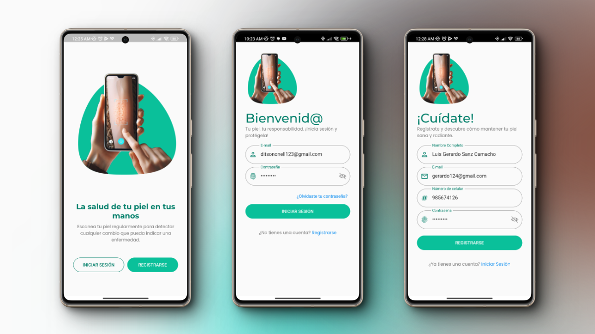
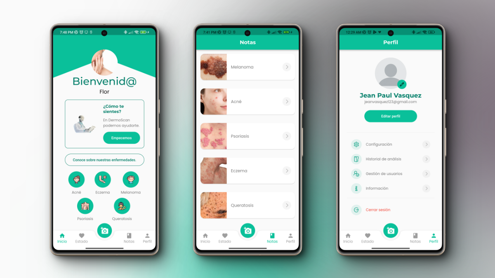
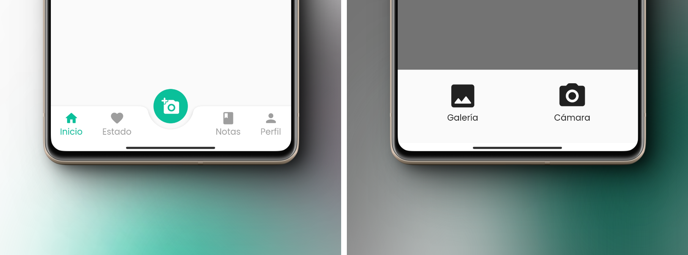
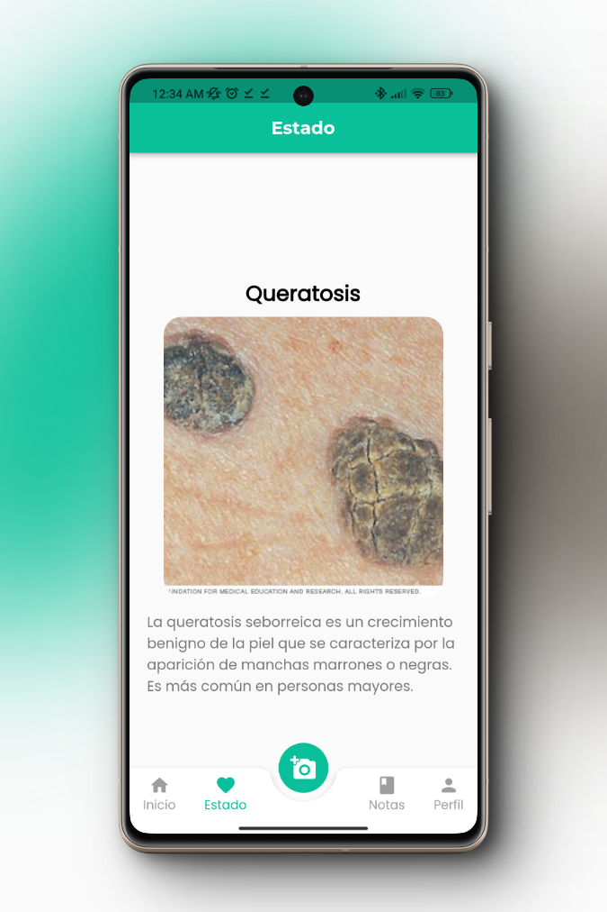

# Dermoscan
Dermoscan es una aplicación móvil en desarrollo para el reconocimiento de enfermedades de la piel. Esta aplicación utiliza tecnología de reconocimiento visual para ayudar a diagnosticar diversas afecciones cutáneas.

## Características
- **Reconocimiento de imágenes**: Analiza fotos de la piel para identificar posibles enfermedades.
- **Multiplataforma**: Disponible para Android, iOS, Linux, macOS, Windows y web.
- **Interfaz amigable**: Diseñada para ser fácil de usar por personas de todas las edades.

## Tecnologías Utilizadas
- **Flutter**: Framework para desarrollo multiplataforma.
- **Dart**: Lenguaje de programación principal.
- C++, CMake, Swift, HTML y C: Utilizados para componentes específicos de la aplicación.

## Instalación
1. Clona el repositorio:
    ```bash
    git clone https://github.com/Paul-06/dermoscan.git
    ```
2. Navega al directorio del proyecto:
    ```bash
    cd dermoscan
    ```
3. Instala las dependencias:
    ```bash
    flutter pub get
    ```
4. Ejecuta la aplicación:
    ```bash
    flutter run
    ```
    
## Estructura del Proyecto
- **android/**: Archivos específicos para Android.
- **ios/**: Archivos específicos para iOS.
- **lib/**: Código fuente principal en Dart.
- **assets/**: Recursos de la aplicación (imágenes, íconos, etc.).
- **test/**: Pruebas unitarias y de integración.
- **web/**: Archivos específicos para la versión web.
- **linux/, macos/, windows/**: Archivos específicos para cada plataforma.

## Contribuciones
Las contribuciones son bienvenidas. Por favor, sigue estos pasos para contribuir:

- Haz un fork del repositorio.
- Crea una rama para tu funcionalidad (git checkout -b feature/nueva-funcionalidad).
- Haz commit de tus cambios (git commit -am 'Añadir nueva funcionalidad').
- Haz push a la rama (git push origin feature/nueva-funcionalidad).
- Abre un Pull Request.

## Capturas del Sistema

### Pantallas de carga y autenticación


### Pantallas Principales


### Apartado de selección de imágenes


### Pantalla de Resultado


## Contacto
Para cualquier pregunta o sugerencia, por favor abre un issue en el repositorio o contácte conmigo.
